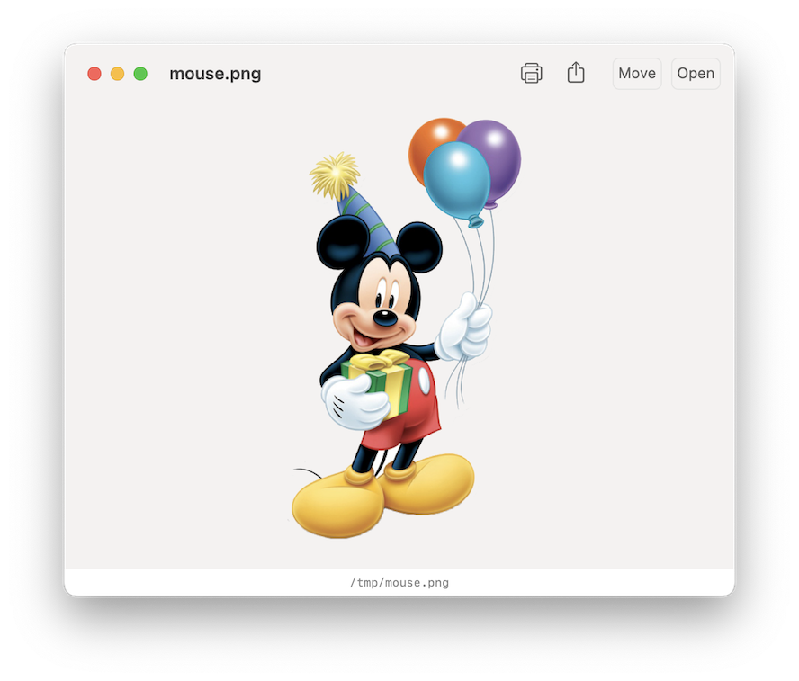

# qlview

This is a standalone document previewer based on macOS's built-in
Quick Look—imagine a nicer `qlmanage`. It's particularly useful as a
quick command-line viewer for terminal applications, like
[mutt](http://www.mutt.org).



## Installation

You currently need to build it yourself. Assuming you have Xcode
installed, either use it to open the project, or run `make release`
from the command line. You will then find an executable in
`build/Release/qlview`.

## Usage

Run it from the command line:

```
# qlview <file>
```

If you execute `qlview` without any arguments, it'll open an empty
window where you can drag a document into.

## Feedback

Feel free to open issues or pull requests.
